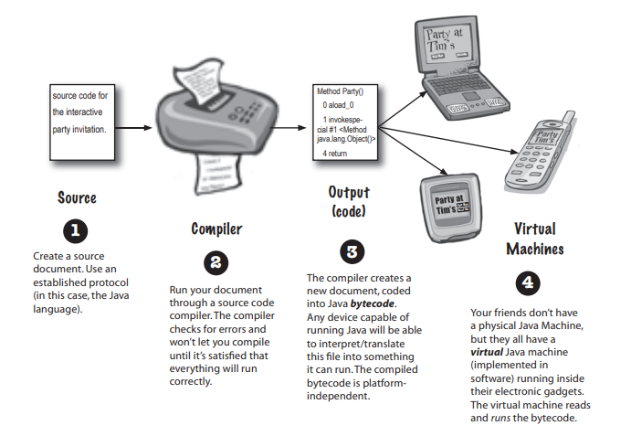
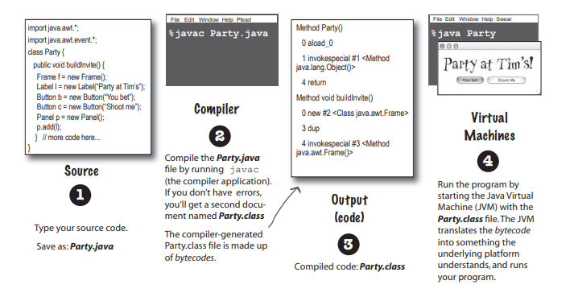
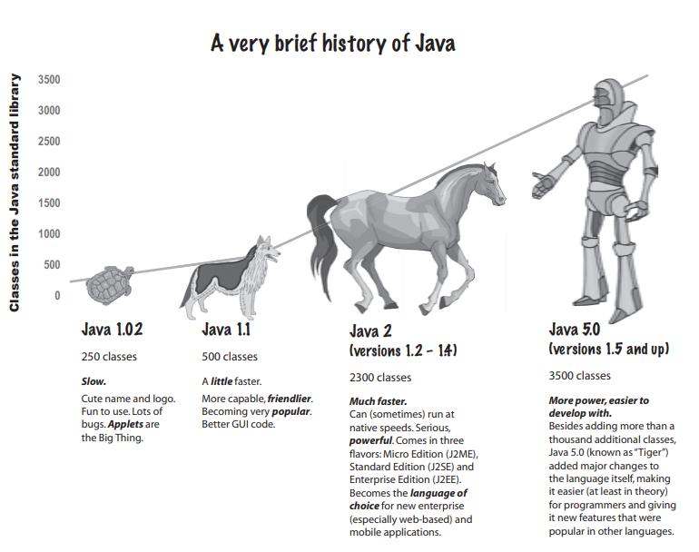
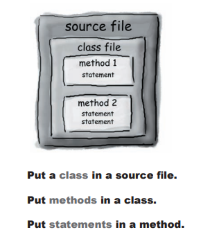
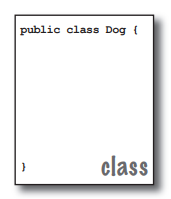
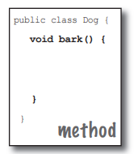
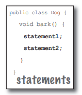
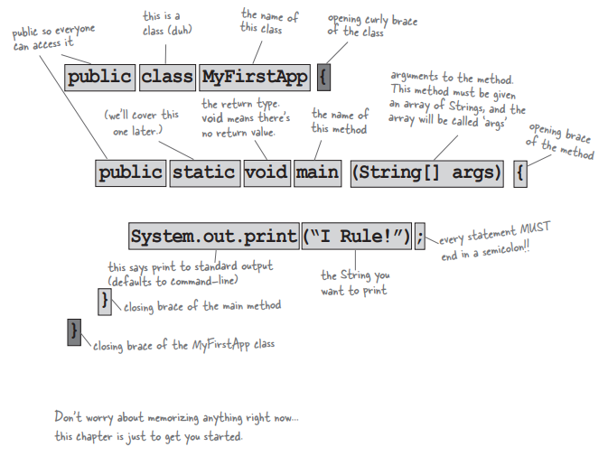
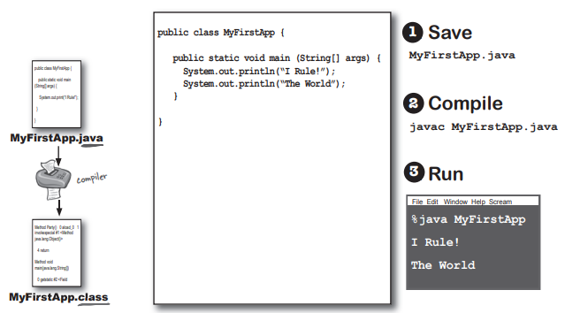

# 第一章 基本概念——进入Java的世界

## 1、Java的工作方式

> 首先，我们需要知道，我们的目标是什么？

在书中，就是让我们**能够写出一个应用程序，并且能够运行在任何设备上**



Java的工作方式：

1. 源代码
2. 编译器
3. 输出
4. Java虚拟机（JVM）


### 我们要做的事

> 那么，我们应该怎么做呢？

结合上述的工作方式，我们要做的也是对应4件事：



1. 编写源代码
2. 执行javac程序来编译源代码，如果没有出错，会产生class字节码文件
3. 编译器的输出结果，就是字节码class文件
4. 启动Java虚拟机，来运行class文件，JVM会将字节码转换成平台能够理解的形式来运行


### Java简史

> Java也是经历的一定的发展历程，此处我们介绍一下



|          |               乌龟                |                小狗                |                    马儿                    |                     机器人                     |
| -------- | :-------------------------------: | :--------------------------------: | :----------------------------------------: | :--------------------------------------------: |
| 类的数量 |                250                |                500                 |                    2300                    |                      3500                      |
| 版本     |               1.02                |                1.1                 |                  1.2~1.4                   |                    1.5&以上                    |
| 特点     | 有可爱的logo和名称，但是bug也挺多 | 功能更强，也更加好用，开始受到欢迎 | 速度有时候能达到平台原始速度，版本也更丰富 | 类达到数以千计，对语言本身也作出了许多重大改变 |


## 2、Java的程序结构

语句 → 方法 → 类 → 源文件



> 什么是源文件？

源文件（扩展名为java）带有类的定义。类用来表示程序的一个组件，小程序或许只有一个类，类的内容必须包括在花括号内。



> 什么是类？

类中带有一个或者多个方法。比如，狗狗类就可以具有bark()方法。方法必须在类的内部申明。



> 什么是方法？

在方法的花括号中编写方法应该执行的指令，方法代码使用一组语句组合而成。




## 3、剖析类

由上述的Java工作方式我们可以得知，当JVM启动后，会寻找命令列中指定的类，然后，会进一步锁定main()方法。

接着，JVM就会执行main中的所有指令。

每个Java程序中最少都会有1个类以及1个mian()

每个应用程序只有1个main()



## 4、main()方法

### 编写带有main()的类

```java
public class MyFirstApp {
    public static void main(String[] args) {
        System.out.println("I Rule!");
        System.out.println("The world");
    }
}
```



Java中的所有东西都会属于某个类，我们会建立源文件（java），然后编译它形成类文件（class）。

真正被执行的是类。

要执行程序代表要命令JVM去加载类（class），开始执行类的main()，然后一直运行到程序代码结束为止。

### 能在main()中做什么？

> 既然main()如此重要，我们能在其中做些什么呢？

1. 做某事
2. 反复做某事
3. 在某些条件下做某件事

分别对应：

1. 声明、设定、调用等普通语句
2. for、while等循环语句（loop）
3. if、else的条件分支语句


## 5、循环

Java中有3中循环语句：

1. while
2. do-while
3. for

循环并不复杂，只要条件为true，循环就会一直执行下去（所以很有必要避免“死循环”）

```java
public class Loopy {
    public static void main(String[] args) {
        int x = 1;
        System.out.println("Before the loop");
        while (x < 4) {
            System.out.println("In the Loop");
            System.out.println("Value of x is " + x);

            x = x + 1;
        }
        System.out.println("This is after the loop");
    }
}
```

所以循环的关键是条件测试。在Java中，条件测试的结果是boolean值

## 6、条件

```java
class ifTest {
    public static void main (String[] args) {
        int x = 3;
        if (x == 3) {
            System.out.println("x must be 3.");
        } else {
            System.out.println("x is not 3.");
        }
        System.out.println("This runs no matter what.");
    }
}
```

上述的代码示例就是一个条件分支的例子（多的咱也不说了，都在代码里了）。

## 7、设计程序

```java
public class BeerSong {
    public static void main(String[] args) {
        int beerNum = 99;
        String word = "bottles";

        while (beerNum > 0) {
            if (beerNum == 1) {
                word = "bottle"; // 单数的瓶子
            }

            System.out.println(beerNum + " " + word + " of beer on the wall");
            System.out.println(beerNum + " " + word + " of beer.");
            System.out.println("Take one down.");
            System.out.println("Pass it around.");
            beerNum = beerNum - 1;

            if (beerNum > 0) {
                System.out.println(beerNum + " " + word + " of beer on the wall");
            } else {
                System.out.println("No more bottles of beer on the wall");
            } // else 结束
        } // while 循环 结束
    } // main 方法 结束
} // class 类 结束

```

## 8、术语制造机

> 我管它叫做废话生成器

```java
public class PhraseOMatic {
    public static void main(String[] args) {
        // 你可以随意加上其他术语
        String[] wordListOne = {"24/7", "Multi-Tier", "30,000 foot", "B-to-B", "win-win", "front-end", "web-based", "pervasive", "smart", "six-sigma", "critical-path", "dynamic"};
        String[] wordListTwo = {"empowered", "sticky", "value-added", "oriented", "centric", "distributed", "clustered", "branded", "outside-the-box", "positioned", "networked", "focused", "leveraged", "aligned", "targeted", "shared", "cooperative", "accelerated"};
        String[] wordListThree = {"process", "tipping-point", "solution", "architecture", "core competency", "strategy", "mind share", "portal", "space", "vision", "paradigm", "mission"};

        // 计算每一组有多少个名词
        int oneLength = wordListOne.length;
        int twoLength = wordListOne.length;
        int threeLength = wordListThree.length;

        // 产生随机数字
        int rand1 = (int) (Math.random() * oneLength);
        int rand2 = (int) (Math.random() * twoLength);
        int rand3 = (int) (Math.random() * threeLength);

        // 组合出专家术语
        String phrase = wordListOne[rand1] + " " + wordListTwo[rand2] + " " + wordListThree[rand3];

        // 输出
        System.out.println("What we need is a " + phrase);

    }
}

```
