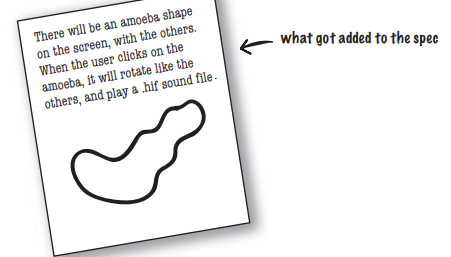
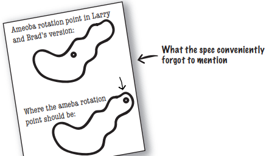
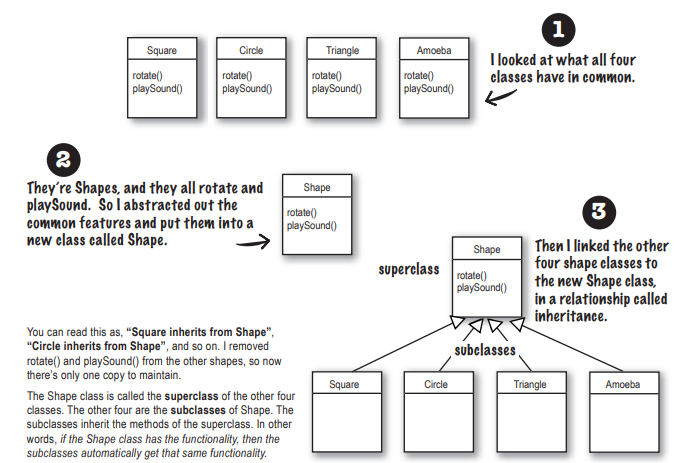
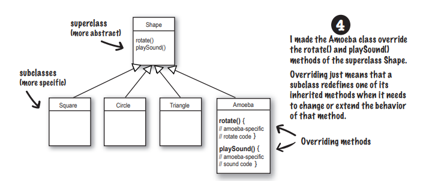
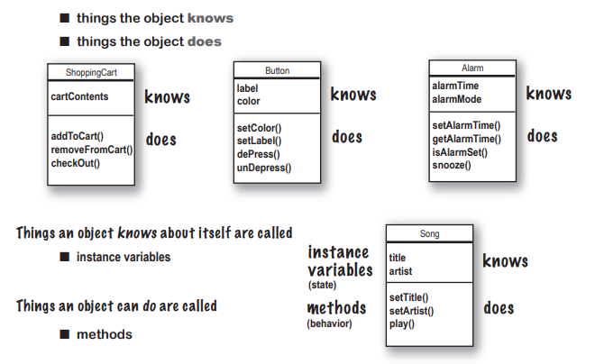
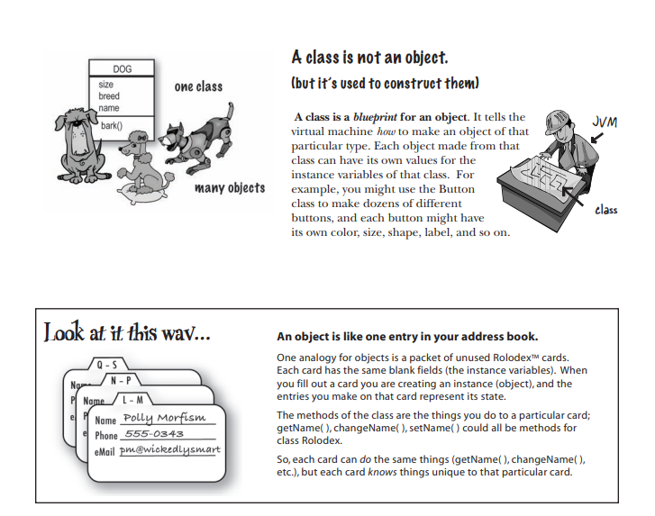

# 第二章 类与对象——拜访对象村

## 1、椅子大战

> 为了让我们了解到“面向对象”这一编程思想的优势，《Head First Java》使用了阿花和阿珠的椅子大战的例子。（有一说一，我也想要Aeron椅子）

在这场对战中，阿珠使用面向过程，阿花使用面向对象。

可以看到，在程序开发的一开始，对于简单规则的几何图形（正方形、圆形、等边三角形等），过程开发还是有点优势的（快嘛）。

但是，当规格或者说需求变得复杂，例如，开发一个阿米巴原虫。



面对这样的需求，过程化的程序还能用，却需要经历修改和复测。

面向对象的程序却只需要新增加一个类就好，旧有的类甚至不用复测！（剧透一下，后续还能够进一步通过抽象出父类达到继承，实现更加简单快捷的开发）

一波未平一波又起，阿米巴原虫的旋转和规则的图形可不相同。



显然，对于这样的情况，阿珠又是有得改了；而阿花只需要简单修改阿米巴原虫类中的旋转点就就行。

## 2、继承

> 看起来阿花似乎要赢了:->（结局是个秘密，最后揭晓）

阿珠不服气，她对阿花的代码提出了这样的质疑：重复太多！

对此，阿花使用了**面向对象的继承**



可以看到，正方形、圆形、等边三角形、阿米巴原虫等都可以抽象成“Shape”。

Shape是4个图像子类的父类，子类可以**继承**父类的方法！

## 3、覆盖

> 阿珠还是不服气，不对啊，阿米巴原虫的旋转方法的和其他几个不一样啊？

这一问题的答案是：子类继承父类，子类也可以**覆盖**父类的方法！



所以，对于面向对象，程序会调用对象的方法，调用的一方不需要知道该对象如何执行这个动作。如果需要加入新的对象，只需要创建该对象类型的类，让新的对象维持自己的行为。

到此，面向对象的编程又征服了一个程序员阿珠，那最后是谁获胜了？

获胜者是阿娇（附带说明，她是老板娘的侄女）

## 4、什么是类？

> 经历过“椅子大战”，我们对面向对象编程已经有了一个基础的认识，现在，是该深入了解一波该如何实现如何编写这样的代码了。现在摆在我们面前的问题是：类是什么？对象又是什么？

不妨以这样的视角看：类是对象的模版，有了这个模版，我们可以批量生成对象。



结合现实世界，可以有这样的理解：

|                          实例变量                          |                             方法                             |
| :--------------------------------------------------------: | :----------------------------------------------------------: |
|                     对象本身已知的事物                     |                      对象可以执行的动作                      |
|                         事物的属性                         |                          事物的行为                          |
| 代表事物的状态，并且该类型下的每一个对象都独立的拥有一份值 | 代表事物可以执行的动作，显然，不同的对象可以通过覆盖实现不同的方法 |



## 5、创建你的第一个对象

> 在深入了解了一波类以及对象之后，是时候写点代码了。

这里确定一个小准则：以后多数情况下都会写2个类

一个是要被操作与对象的类，例如下面的Dog

一个是用来测试该类的类，例如下面的DogTestDrive

```java
class Dog {
    int size;
    String bread;
    String name;

    void bark() {
        System.out.println("Ruff! Ruff!");
    }
}
```

```java
class DogTestDrive {
    public static void main(String[] args) {
        Dog d = new Dog();
        d.size = 40;
        d.bark();
    }
}
```

再来一个Movie进一步深化一下印象

```java
class Movie {
    String title;
    String genre;
    int rating;
    void playIt() {
        System.out.println("Playing the movie");
    }
}
```

```java
public class MovieTestDrive {
    public static void main(String[] args) {
        Movie one = new Movie();
        one.title = "Gone with the Stock";
        one.genre = "Tragic";
        one.rating = -2;

        Movie two = new Movie();
        two.title = "Lost in Cubicle Space";
        two.genre = "Comedy";
        two.rating = 5;

        Movie three = new Movie();
        three.title = "Byte Club";
        three.genre = "Tragic but ultimately uplifting";
        three.rating = 127;
    }
}
```

## 6、使用main()

> 好了，是时候批判一下main()方法，真正摆脱面向过程了

如果还是要在main中编写大部分代码，那么就是完全没有进入对象村。

不过，对于测试类，呆在mian中还是可以的（甚至相当不错！:->）

所以，对于main()方法，今后只有以下2个用途：

1. 测试真正的类
2. 启动我们的Java应用程序

真正的Java程序只会让对象和对象交互！猜数字这个程序就是一个“预览”。

## 7、猜数字

```java
public class GuessGame {
    Player p1;
    Player p2
            ;
    Player p3;

    public void startGame() {
        p1 = new Player();
        p2 = new Player();
        p3 = new Player();

        int guessp1 = 0;
        int guessp2 = 0;
        int guessp3 = 0;

        boolean p1isRight = false;
        boolean p2isRight = false;
        boolean p3isRight = false;

        int targetNumber = (int)(Math.random()*10);
        System.out.println("I'm thinking of a number between 0 and 9...");

        while (true) {
            System.out.println("Number to guess is "+targetNumber);

            p1.guess();
            p2.guess();
            p3.guess();

            guessp1 = p1.number;
            System.out.println("Player one guessed "+guessp1);

            guessp2 = p2.number;
            System.out.println("Player two guessed "+guessp2);

            guessp1 = p3.number;
            System.out.println("Player three guessed "+guessp3);

            if (guessp1 == targetNumber) {
                p1isRight = true;
            }
            if (guessp2 == targetNumber) {
                p2isRight = true;
            }
            if (guessp3 == targetNumber) {
                p3isRight = true;
            }

            if (p1isRight || p2isRight || p3isRight) {
                System.out.println("We have a winner!");
                System.out.println("Player one got it right? "+p1isRight);
                System.out.println("Player two got it right? "+p2isRight);
                System.out.println("Player three got it right? "+p3isRight);
                System.out.println("Game is over.");
                break;
            } else {
                System.out.println("Players will have to try again.");
            }
        }
    }
}
```

```java
public class Player {
    int number = 0;

    public void guess() {
        number = (int) (Math.random() * 10);
        System.out.println("I'm guessing " + number);
    }
}
```

```java
public class GameLauncher {
    public static void main(String[] args) {
        GuessGame game = new GuessGame();
        game.startGame();
    }
}
```

补充一波知识：java会拾荒

1. 创建对象时，会被存放在名为“堆”的内存区域之中
2. java的堆并不普通，可以自动回收垃圾（也就是说，java会自动帮我们管理内存）

所以，在上面的猜数字游戏程序中，我们没有手动管理内存，是java的虚拟机自动帮我们管理好了（C++你看看人家java！）
