# 第三章 认识变量——primitive主数据类型和引用

## 1、声明变量

> 变量！变量还是tmd变量！（重要的事物多说几遍！）

Java是面向对象的编程语言，这一点我们在上一章中已经有所见识

所以Java关注对象，也关注类。**Java中注重类型**（我们也很难想象使用一个兔子类来存储一个长颈鹿）

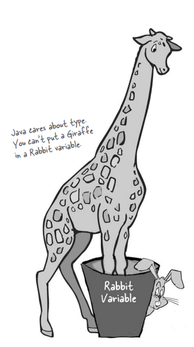

错误的声明编译器一般都会帮我们支出（不过没有必要还是不要麻烦他了）

所以，为了让变量能够安全的使用，有两点需要注意：

1. 变量必须拥有**类型**
2. 变量必须拥有**名称**

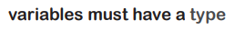


这里剧透一波，变量的类型分为2个大类

1. primitive主数据类型
2. 引用


## 2、Primitive主数据类型

> 如果想要形象的理解变量的本质，杯子或许是一个很不错的比喻！
>
> 先用杯子来理解一波primitive主数据类型

变量就像是杯子，是一种容器，用来承载某些事物。它具有大小和类型。

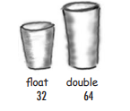

|  杯子  | 变量  |
| :----: | :---: |
|  小杯  | byte  |
|  中杯  | short |
|  大杯  |  int  |
| 超大杯 | long  |

当然，除了整数类型的杯子，还有其他类型的杯子。

每个杯子都又大小，可以装载液体；每种primitive主数据类型都具有固定的位数，用来装载基本的数据。

|  类型   | 位数（bits） |          值域          |
| :-----: | :----------: | :--------------------: |
| boolean |              |     true or false      |
|  char   |      16      |        0~65535         |
|  byte   |      8       |        -128~127        |
|  short  |      16      |      -32768~32767      |
|   int   |      32      | -2147483648~2147483647 |
|  long   |      64      |          很大          |
|  float  |      32      |          很大          |
| double  |      64      |          很大          |

这些primitive主数据类型可以划分为**四类八种**

> Be Careful! Bears Shouldn't Ingest Large Furry Dogs

```java
float f = 32.5f;
// float类型的数据后面可以加上一个f，否则会被java当作double处理
```

> 小杯子装不了太多的水，否则会溢出来

这也是在使用primitive主数据类型时，需要注意的一个点！

所以编程时，别用byte储存123456789！

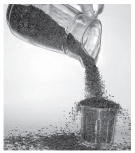

结束类型，可以看一下Java是如何给变量赋值的：

1. 在等号后面直接打出（x=12）
2. 指派其他变量的值（x=y）
3. 上述方式的组合（x=y+12）

## 3、Java关键字

> 关于变量的类型差不多了，接着该看看变量的命名了，如何给变量们起一个好名字？

命名必须遵守一下规则：

1. 名称必须以字母、下划线或者$符号开头，不能用数字开头
2. 除了第一个字母之外，后面就可以用数字（反正数字不能在第一个字符）
3. 只要符合上述的2条规则，就可以随意的命名，不过还需要避开Java保留的**关键字/保留字**

关于保留字，其实已经见过不少了

public

void

static

……

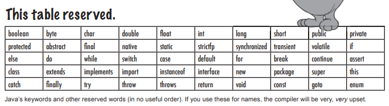

## 4、引用变量

> 了解了primitive主数据变量后，是时候学习”引用“变量了。也就是该考虑Java是如何处理对象的呢？

关于引用，又以下事实：

1. 事实上没有对象变量这样的东西存在
2. 只有引用到对象的变量
3. 对象引用变量保存的是存取对象的方法
4. 它不是对象的容器，而是类似于指向对象的指针，或者说地址。在Java中我们不会也不该知道引用变量中实际装载的是什么。它只是用来代表单一的对象，只有Java虚拟机才知道如何使用引用来取得该对象。

相比primitive主数据类型，对象明显复杂的多，即使是同一个类模版下的对象，也完全可能具有不同的属性值和方法实现。

所以不难理解，如果要使用一个杯子来装载对象，这个”杯子“该多么奇形怪状。

显然，让杯子装载”引用“，引用再指向对象，就合理有序的多，好比杯子中装的都是遥控器，遥控器可以控制到电视

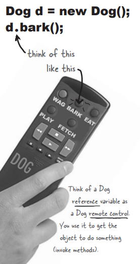

## 5、对象的声明与赋值

> 对象创建过程中都干了什么事

1. 声明一个引用变量
2. 创建对象
3. 连接对象和引用

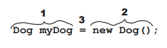

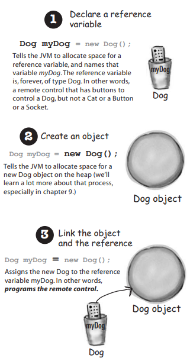

## 6、可回收堆空间

> 对象很复杂，所以不像primitive们一样，而是建立对象建立在堆上，那为什么要这么做？有什么好处？

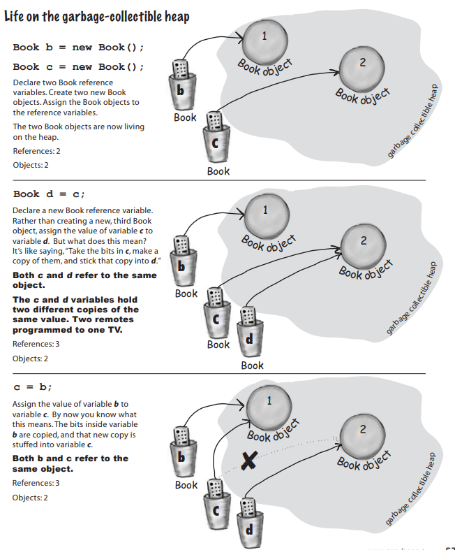

堆上的对象和变量之间有”引用“关联，这样处理，调整引用可以非常方便，和primitive的赋值从某种抽象的程度上来说，几乎没有什么不同。

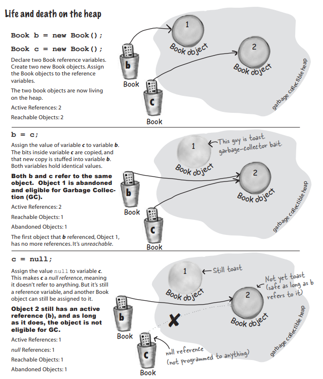

弃用对象也非常简单，断掉引用即可。而被弃用的对象，就成了垃圾，享受被Java回收利用的待遇。

## 7、数组

> 为了之后的学习，这里介绍一种比较常用的对象——数组

数组很像杯子架

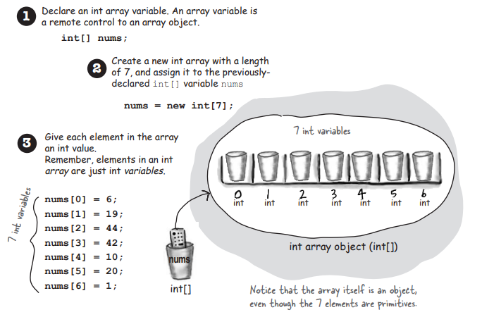

```java
int[] nums;
nums = new int[7];
```

特别需要注意的是，虽然简单的代码示例中数组存储了int类型的数据，但数组本身仍是对象！对象！对象！

无论被声明来承载的是primitive主数据类型还是对象引用，**数组永远是对象**

数组只是能够让我们使用位置索引来快速、随机存取元素的的”杯子架“。

```java
class Dog {
    String name;

    public void bark() {
        System.out.println(name + " says Ruff!");
    }

    public void eat() {
    }

    public void chaseCat() {
    }

    public static void main(String[] args) {
        // 创建Dog对象
        Dog dog1 = new Dog();
        dog1.bark();
        dog1.name = "Bart";

        // 创建Dog数组
        Dog[] myDogs = new Dog[3];
        // 关门放狗
        myDogs[0] = new Dog();
        myDogs[1] = new Dog();
        myDogs[2] = dog1;

        // 通过数组引用存取Dog
        myDogs[0].name = "Fred";
        myDogs[1].name = "Merge";

        // myDog[2]的名字是?
        System.out.print("last dog's name is ");
        System.out.println(myDogs[2].name);

        // 逐个对Dog执行bark()
        int x = 0;
        while (x < myDogs.length) {
            myDogs[x].bark();
            x = x + 1;
        }
    }
}
```

