# 第四章 对象的行为——方法操作实例变量

## 1、操作对象状态的方法

> 状态影响行为，行为影响状态。
>
> 我们已经知道对象又状态和行为2大部分组成，分别用“实例变量”和“方法”来表示，第三章中对变量进行了一定的学习，现在是时间研究研究“**方法**”了。

回忆一下，类是描述什么来着的？

1. 对象知道什么——属性——实例变量
2. 对象执行什么——行为——方法

类是对象的蓝图，正是因为有了类，JVM才知道该如何制作对应的对象。

> 任一类的对象具有相同的方法，不过方法可以根据实例变量的值，从而表现出不同的行为。


下面的代码就用狗子展现了这一点：

```java
class Dog {
    int size;
    String name;

    void bark() {
        if (size > 60) {
            System.out.println("Woof! Woof!");
        } else if (size > 14) {
            System.out.println("Ruff! Ruff!");
        } else {
            System.out.println("Yip! Yip!");
        }
    }
}
```

```java
class DogTestDrive {
    public static void main(String[] args) {
        Dog one = new Dog();
        one.size = 70;
        Dog two = new Dog();
        two.size = 8;
        Dog three = new Dog();
        three.size = 35;

        one.bark();
        two.bark();
        three.bark();
    }
}
```

显然，不同大小的狗子，叫起来后也是不同的（状态确实影响了行为）

## 2、方法参数与返回类型

> 好吧，让我们仔细看看状态确实影响行为这一过程是怎么发生的，又是如何把值传给方法的，以及这个过程中我们都需要注意些什么。

```java
dog.bark(3);
// 叫了3声

void bark(int numOfBarks) {
    while(numOfBarks > 0) {
        System.out.println("ruff");
        numOfBarks = numOfBarks - 1;
    }
}
```

当我们传值时，就涉及到了“实参”、“形参”这2个概念。

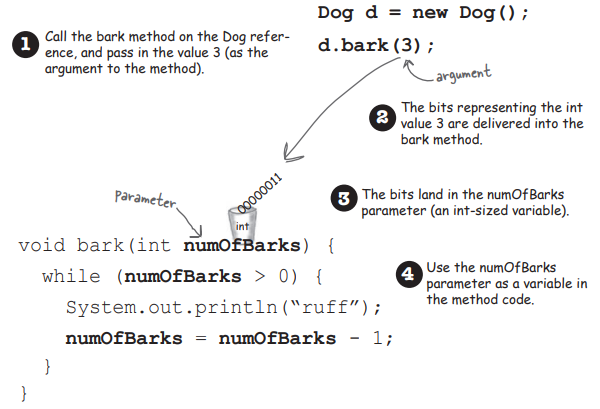

上面的示例代码中，调用dog对象的bark方法是，3就是实参；而下面的bark方法定义里的numOfBarks就是形参。

> 我们给方法传了值，那方法呢？它就不表示表示？

确实，方法也可以返回值。


每个方法都可以返回值，而且必须声明返回的类型，例如void。


注意：说好了要返回，最好就得返回！（言而有信嘛，不得是）；而且返回的类型必须要和声明相同（总不能声明money却返回了个鸭子）

> 那我们该如何意思意思？那方法又怎样表示表示？

方法很傲娇，我们可以给一个方法传入多个参数；而方法最多只会返回一个结果。

方法可以又多个参数。在声明时，用逗号隔开，传入的时候也是用逗号隔开。

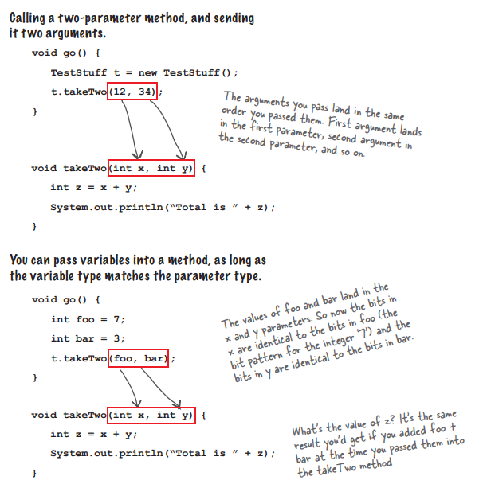

如果方法有参数，一定要用正确的数量、类型和顺序来传递参数！

感觉和追小姑娘有异曲同工之妙

## 3、值传递

> 粗浅的传过来送过去已经说完了，该探讨一下具体是怎么送的了

java传递参数过程中用的是“值传递”。

这表示，变量们只是把值传了过去。他们玩了一招copy大法，仍是用dog.bark(3)为例子，这个过程中，3的值被复制了一份，然后才传给了numOfBarks

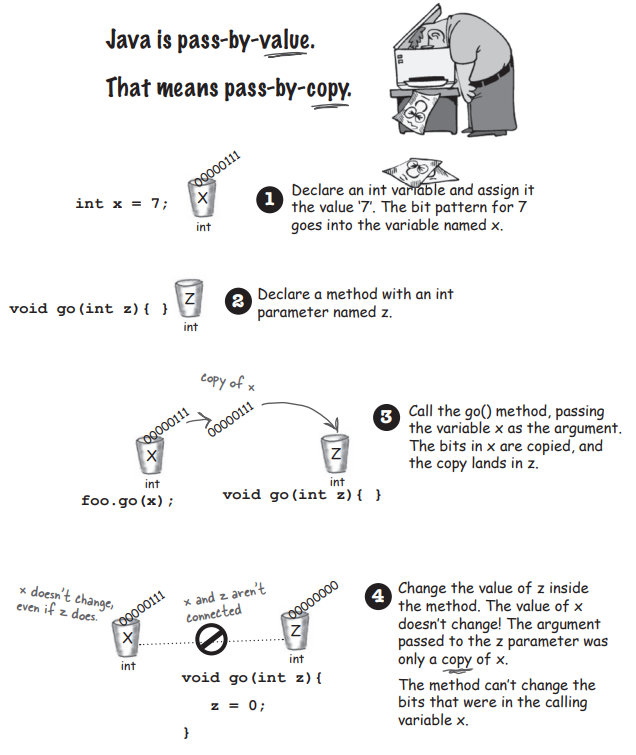

> think：如果是引用变量，又怎么传？

Don't think too much! 引用变量中存的是引用，所以copy的也是引用，相当于多出了一个引用指向变量。

## 4、Getters与Setters

> 好了，说了一大堆关于参数和返回类型。它们有什么必要的用处呢？

来认识一下Getter与Setter吧

```java
class ElectricGuitar {
    String brand;
    int numOfPickups;
    boolean rockStarUsesIt;

    public String getBrand() {
        return brand;
    }

    public void setBrand(String brand) {
        this.brand = brand;
    }

    public int getNumOfPickups() {
        return numOfPickups;
    }

    public void setNumOfPickups(int numOfPickups) {
        this.numOfPickups = numOfPickups;
    }

    public boolean isRockStarUsesIt() {
        return rockStarUsesIt;
    }

    public void setRockStarUsesIt(boolean rockStarUsesIt) {
        this.rockStarUsesIt = rockStarUsesIt;
    }
}
```


如上面的代码所示

Getter只有一个目的：返回实例变量的值

Setter只有一个目的：取用一个参数来设置实例变量的值

## 5、封装

> 封装啊，封装（encapsulation）

在之前的代码中，我们一直忽视了一个错误（相当严重的错误！）

**资料泄漏**

还记得这样的代码嘛？

```java
tehCat.height = 27;
```

细思极恐，如果我们可以这样直接的“远程控制”tehCat的实例变量，这不就意味着别人可以这样做

```java
tehCat.height = 0;
```

能想象height为0的cat嘛？

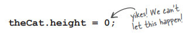

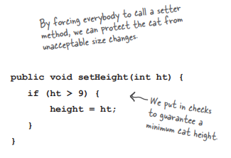

显然，用了setHeight后，不用担心小猫体重被设成0了。

具体深入到Java中的数据隐藏，我们会使用private和public这2个存取修饰符号。

一般是将实例变量private，将Getter与Setter方法public

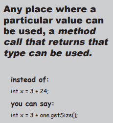

```java
class GoodDog {
    int size;
    String name;

    void bark() {
        if (size > 60) {
            System.out.println("Woof! Woof!");
        } else if (size > 14) {
            System.out.println("Ruff! Ruff!");
        } else {
            System.out.println("Yip! Yip!");
        }
    }

    public int getSize() {
        return size;
    }

    public void setSize(int s) {
        this.size = s;
    }
}
```

```java
class GoodGoodDogTestDrive {
    public static void main(String[] args) {
        GoodDog one = new GoodDog();
        one.setSize(70);
        GoodDog two = new GoodDog();
        two.setSize(8);

        System.out.println("Dog one: " + one.getSize());
        System.out.println("Dog two: " + two.getSize());
        one.bark();
        two.bark();
    }
}
```


## 6、数组中的引用

> 最后额外研究些内容，例如数组中的对象。

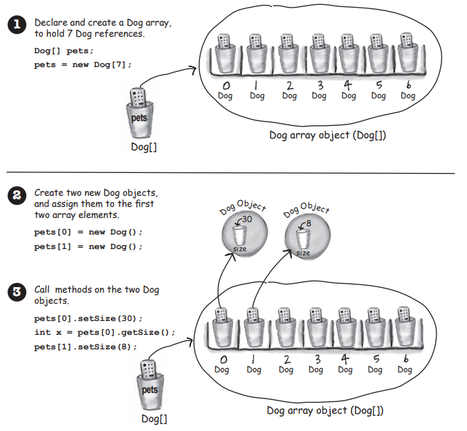

数组中当然可以存储对象，唯一的差别是，如何取得。

想象成取得杯子里的遥控器，是不是easy多了？

```java
DOg[] pets;
pets = new Dog[7];

pets[0] = new Dog();
pets[1] = new Dog();

pets[0].setSize(30);
int x = pets[0].getSize();
pets[1].setSize(8);
……
```

以下是我本章最后的知识啦！JOJO！

> 变量声明至少需要类型和名称，同时也可以初始化（init），如果没有init呢？

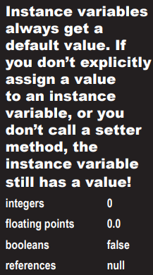

不用担心，Java贴心的提供了默认值，例如int没有初始化，就会给个0；

> 都是变量，怎么还分实例变量和局部变量呢？

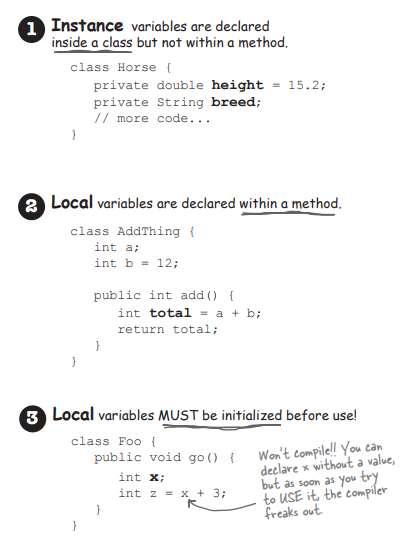

1. 实例变量生命在类中，而不是在方法里
2. 局部变量是声明在方法中的
3. 局部变量在使用前必须初始化

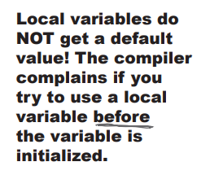

```java
class Foo {
    public void go() {
        int x;
        int y = x + 3;
    }
}
// 显然，这里没有initial的x一定会导致程序报错
// 因为局部变量没有默认值！局部变量没有默认值！局部变量没有默认值！
```

> 有时我们需要知道2个变量是否相等，不过这简单的一个比较，也含有讲究。

如果是primitive主数据类型，使用==直接比较就行

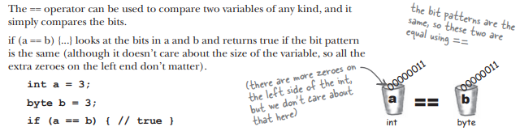

而如果是引用变量，那最好使用equal方法，因为根据java的设定，用==比较对象，只会比较引用是否相同，显然，只有指向同一个对象时，才会是true！


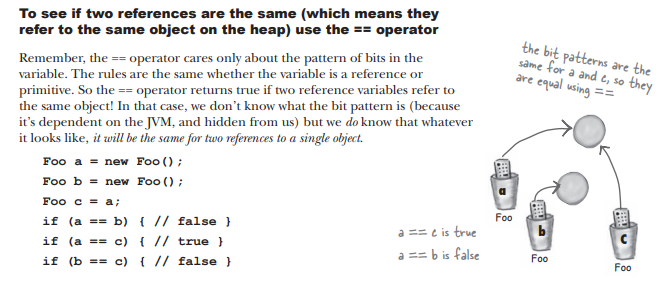