# 第五章 编写程序——超强力方法

## 1、创建战舰游戏

> 都学习了4章内容，是时候根据之前学习的内容，开始着手编写一下程序了。从战舰游戏开始吧。

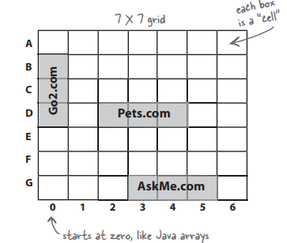

这个战舰游戏非常简单，有个7*7的方格，方格中存在随机生成的连续格子（一般3个），玩家操纵战舰进行射击，只要命中格子的位置就得分。（规则简单吧！）

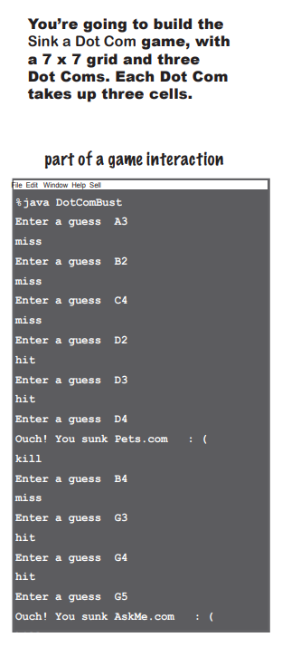

## 2、简单版

> 出于由浅入深的概念，我们先从一个easy版本开始。

easy要涉及的细节更少一些（更适合初学者宝宝）

那就先从高层设计开始吧

> 我们需要类和方法，但是需要哪些呢？

可以确定的是，下面几个过程是少不了的：

1. 玩家启动游戏
2. 游戏开始
3. 游戏结束

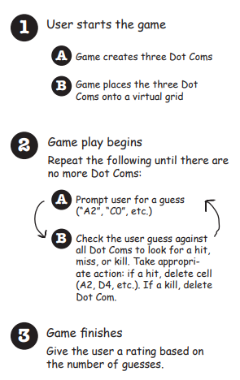

用流程图表示的话就是下面这样：

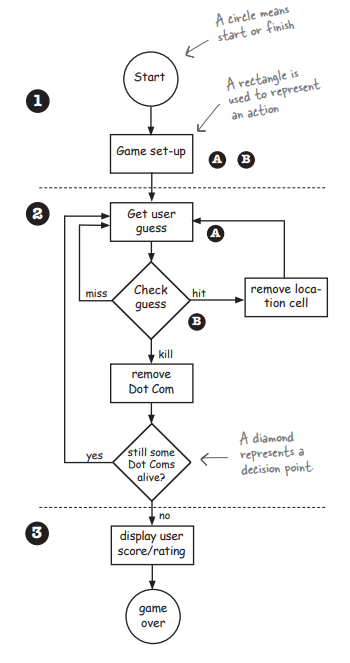

可以发现，游戏中dotcom是个非常重要的对象（要被击中摧毁的就是它）

让我们从最基本的情况开始，游戏开始，创建一个dotcom对象，它具有连续存储3个位置信息的属性，还要能够检查这个对象有没有被击中，以及被击中的几次……

由此，我们对要怎么编写程序就有了一定的头绪，下面是具体的可行做法：

1. 找出类应该做的事情
2. 列出实例变量和方法
3. 编写方法的伪码
4. 编写方法的测试用例程序
5. 实现类
6. 测试方法
7. 除错或者重新设计
8. 邀请辣妹参加庆功派对（大雾，但是很期待！）

从想法到具体的代码，一个类以及它的方法基本要经过下面的阶段：

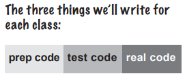

* 伪码
  * 伪码能够帮助我们专注于逻辑而不需要顾虑到程序语法
* 测试码
  * 测试用的程序代码
* 真实码
  * 实际设计出的真正的Java代码

## 3、编写伪码

> 编写程序时，从哪个类开始创建呢？本例中，SimpleDotCom似乎是个不错的开始

让我们看看SimpleDotCom的伪码

认识一下伪码的3个部分：

1. 实例变量的声明
2. 方法的声明
3. 方法的逻辑

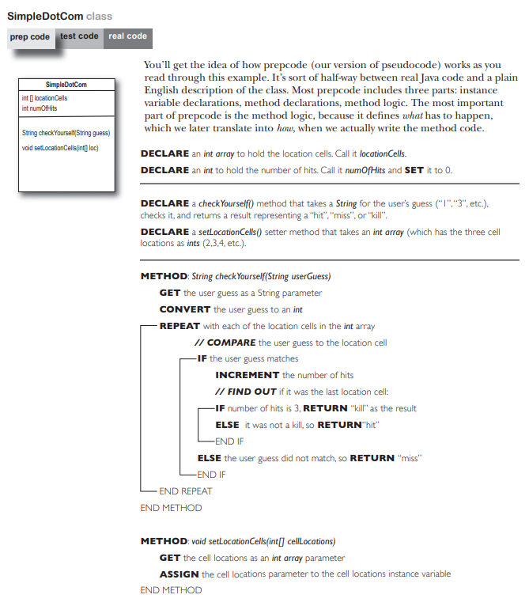

## 4、测试

> 这里一个非常违反常识的情况是，测试放在代码编写完成之前。Trust me，你会知道这样做相当具有好处。

我们会在有东西可以测试前就先写出测试用的部分

先编写测试用程序代码的概念来自极限编程（xp）方法论

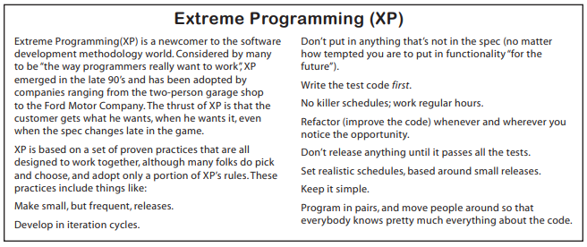

既然XP确实挺cool，那就让我们开始为SimpleDotCom编写测试码吧

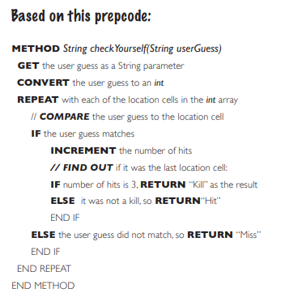

我们都要测试哪些东西呢？

* SimpleDotCom对象的初始化
* 3个连续存储位置赋值
* 创建游戏玩家猜想的数字字符串
* 传入伪造的玩家猜测来叫用checkYouself()方法
* 列出结果，观察是否正确
* ……

> 回答开头的问题：思考和编写测试用的程序代码有助于我们了解到被测试的程序应该做某事，也就是换个角度来设计！

```java
public class SimpleDotComTestDrive {
    public static void main(String[] args) {
        SimpleDotCom dot = new SimpleDotCom();
        int randomNum = (int) (Math.random() * 5);

        int[] locations = {2, 3, 4};
        theDotCom.setLocationCells(locations);

        String userGuess = "2";
        String result = dot.checkYourself(userGuess);
        String testResult = "failed";
        if (result.equals("hit")) {
            testResult = "passed";
        }
       System.out.println(testResult);
    }
}
```

## 5、编写程序

```java
public String checkYourself(String stringGuess) {
    int guess = Integer.parseInt(stringGuess);
    String result = "miss";
    
    for (int cell : locationCells) {
        if (guess == cell) {
            result = "hit";
            numOfHits++;
            break;
        }
    }
    if (numOfHits == locationCells.length) {
        result = "kill";
    }
    System.out.println(result);
    return result;
}
```

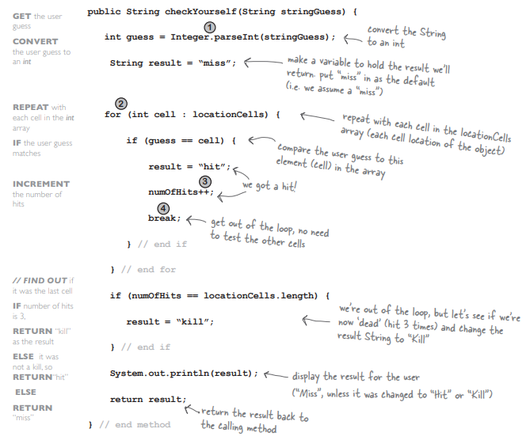

```java
// 这句代码涉及了Integer.parseInt
// 这可是个新玩意儿
int guess = Integer.parseInt(stringGuess);

for (int cell : locationCells) {
    if (guess == cell) {
        result = "hit";
        numOfHits++;
        break;
    }
}
```

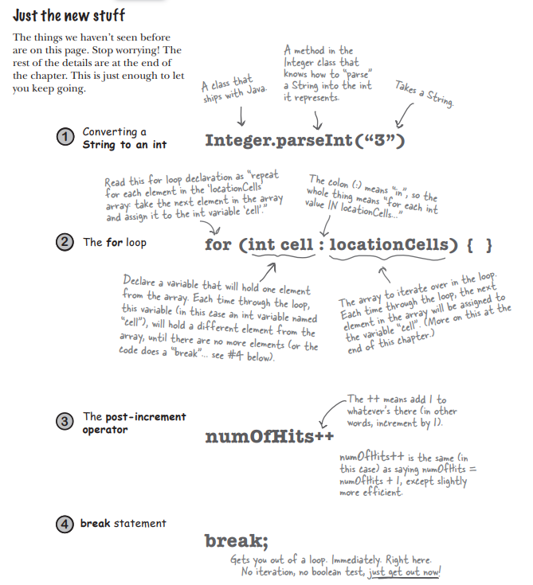

## 6、完成版

> 经过上面的步骤，我们已经有了一个较为完善的版本

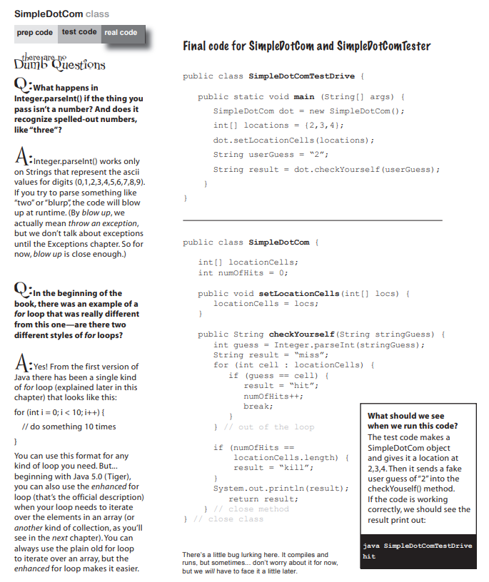

```java
public class SimpleDotComTestDrive {
    public static void main(String[] args) {
        int numOfGuess = 0;
        GameHelper helper = new GameHelper();

        SimpleDotCom theDotCom = new SimpleDotCom();
        int randomNum = (int) (Math.random() * 5);

        int[] locations = {randomNum, randomNum + 1, randomNum + 2};

        theDotCom.setLocationCells(locations);

        boolean isAlive = true;

        while (isAlive == true) {
            String guess = helper.getUserInput("enter a number");
            String result = theDotCom.checkYourself(guess);
            numOfGuess++;
            if (result.equals("kill")) {
                isAlive = false;
                System.out.println("You took " + numOfGuess + " guesses");
            }
        }
    }
}
```

## 7、用Math.random()产生随机数

> 接着研究main，我们来看看如何使用Math.random()

* (int)类型转换
* Math.random()会返回一个0到1之间的数字

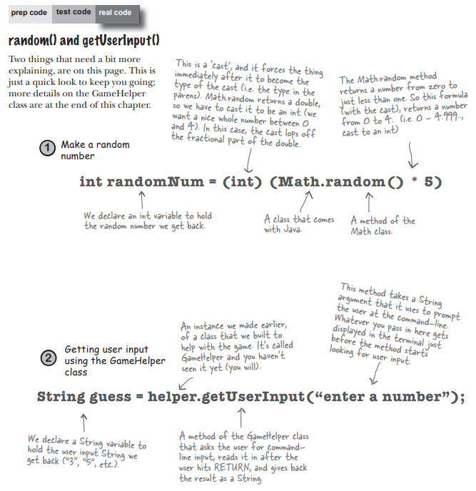

## 8、预先输入好的程序

> 终于啊，终于
>
> 直接ctrl c + v

```java
import java.io.*

public class GameHelper {
    public String getUserInput(String prompt) {
        String inputLine = null;
        System.out.println(prompt + " ");
        try {
            BufferedReader is = new BufferedReader(new InputStreamReader(System.in));
            inputLine = is.readLine();
            if (inputLine.length() == 0) {
                return null;
            }
        } catch (IOException e) {
            System.out.println("IOException: " + e);
        }
        return inputLine;
    }
}
```

现在启动程序，结果大概会如下：

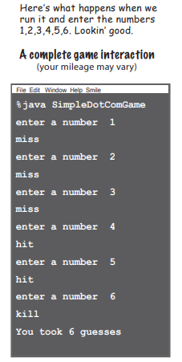

不过不知道你发现没有，如果有这样的输入，程序也会提示玩家获胜，但这却违背了游戏的设计规则（不过不急，这个问题我们下一章研究）

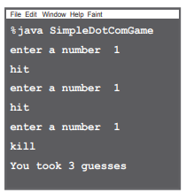

## 9、循环

> for循环和增强版for循环

```java
// 非加强的for循环
for (int i = 0; i < 100; i++) {}

// 示例
for (int i = 0; i < 8; i++) {
    System.out.println(i);
}
System.out.println("done");
```

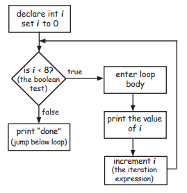

for循环相当适合知道要循环多少次的情况

这种普通的for循环，在编译器看来是这样执行的：

1. 初始化
2. boolean测试
3. 重复表达式

与之相比，while循环则更适合不知道要循环多少次的情况

## 10、类型转换

> 数据之间可以转换，强制转换的类型也很甜！

介绍primitive主数据类型时，我们说过，可以用大杯子装小杯子的数据。

而事实上，如果非要用小杯子装载大杯子的数据，也不是不行

例如

```java
long l = 123456789L;
short s = 1;
// 虽然这样做后的结果很怪异，不过不是不可以（只要确实是你需要的结果）
s = (int)l;
```


## 11、用Integer.parseInt()转换字符串

> 那对象能否转成primitive呢？尤其是“2”这样的字符串，毕竟它和2可太像了！

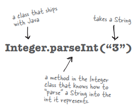

答案是可以

只不过需要一些强力的方法

```java
Integer.parseInt("2");
// 类似的还有
Long.parseLong("3.14");
```

